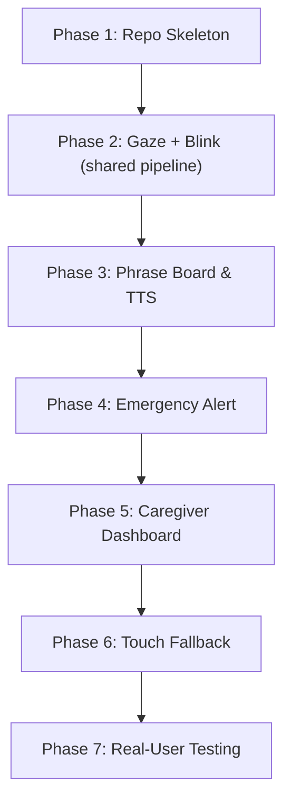

# VoiceBridge: Project Scope & Roadmap

VoiceBridge is an AAC (Augmentative and Alternative Communication) web application designed specifically for patients with severe motor and speech impairments. The application uses eye-tracking and blink gestures as the primary input modality to facilitate communication and caregiver alerts.

## Project Repository
- **GitHub Repository**: https://github.com/SanyamViz/VoiceBridge

---

## Scope Definition

### Core Features (In Scope)

1. **Eye-Tracking via MediaPipe FaceLandmarker**
   - Integration of MediaPipe FaceLandmarker (local WASM + model) as the core gaze-tracking and face-analysis library. Single camera pipeline shared with blink detection.
   - Screen-based calibration system optimized for patients with limited motor control.

2. **Blink Gesture Detection**
   - Precise classification of blink patterns with the following mapping:
     - **Single Blink**: Confirm / Select
     - **Double Blink**: Cancel / Go Back
     - **Triple Blink**: Emergency Shortcut (triggers alert system)
     - **Hold Blink**: Mute / Pause tracking
   - Fallback path configuration for patients with poor blink control.

3. **Gaze Dwell-to-Select Phrase Board**
   - A grid of commonly used words, phrases, and categories.
   - Visual dwell feedback (e.g., circular progress indicator on hover) to confirm intent without requiring blinks.

4. **TTS (Text-to-Speech) Output**
   - Integration with the browser's Web Speech API to vocalize selected phrases.
   - Volume and speed adjustments tailored for ease of communication.

5. **Safety-Critical Emergency Alert**
   - Emergency warning mechanism combining a specific gaze zone (e.g., top-right corner of screen) and a triple blink.
   - Fallback path (e.g., prolonged gaze dwell on emergency zone) for patients with poor blink control.
   - Integration with Firebase Cloud Messaging / Firestore to dispatch real-time alerts to caregivers.

6. **Tracking-Lost / Confidence Indicator**
   - Real-time indicator representing the tracking status (e.g., Poor Lighting, Face Lost, Calibrated, High/Low Confidence).
   - Clear visual/auditory feedback to prompt caregiver realignment or recalibration when tracking degrades.

7. **Caregiver Dashboard**
   - Secure portal (via Firebase Authentication) for caregivers to monitor patient status, view active alerts, adjust dwell speeds, and customize phrase lists (stored in Firestore).

8. **Touch Input (Fallback Only)**
   - Touch/click inputs allowed only as an accessibility fallback or during system calibration/maintenance by caregivers. **Never** designed as the primary patient interface.

### Out of Scope
*   **Switch-Scanning Input**: Explicitly excluded from this phase of the project. Do not implement switch control or scanning.

---

## Phased Roadmap & Build Order

To ensure a robust, safety-validated implementation, the project is structured into the following phases:

### Phase 1: Repo Skeleton
- Initialize React application.
- Set up Firestore and Firebase Auth configurations.
- Structure basic routing, styling system (Vanilla CSS), and layout frames.

### Phase 2: Gaze Tracking, Calibration & Blink Detection
- Build on MediaPipe FaceLandmarker — single camera pipeline, single frame loop.
- Gaze: iris-position extraction, EMA smoothing, 9-point calibration with accuracy scoring.
- Blink: eyelid-landmark EAR (Eye Aspect Ratio) detection sharing the same FaceLandmarker instance.
- Map and test blink gestures: single, double, triple, and hold.
- Confidence tracker feeding both gaze cursor state and blink gesture recognition.
- Unit tests for calibration math, confidence state machine, and blink classification.

### Phase 3: Phrase Board & TTS
- Create the visual board grid with dwell-to-select animation feedback.
- Connect Web Speech API for phrase vocalization.
- Ensure interface scales cleanly for different screen dimensions.

### Phase 4: Emergency Alert
- Define safety-critical gaze zones (e.g., emergency button on screen).
- Bind triple blink gesture inside the emergency zone to fire alerts.
- Build the fallback trigger mechanism for users with weak/unstable blink control.
- Write tests for the state machine handling emergency alerts.

### Phase 5: Caregiver Dashboard
- Secure login and registration.
- Configurable patient profile variables (dwell speed threshold, custom phrases).
- Real-time alert notifications powered by Firebase.

### Phase 6: Touch Fallback
- Enable click-to-select fallback interaction path.
- Add toggle for caregiver override/setup mode.

### Phase 7: Real-User Testing & Verification
- Perform browser subagent execution of calibration and emergency paths.
- Test under variable lighting and alignment conditions.
- Gather feedback and perform final performance optimizations.
